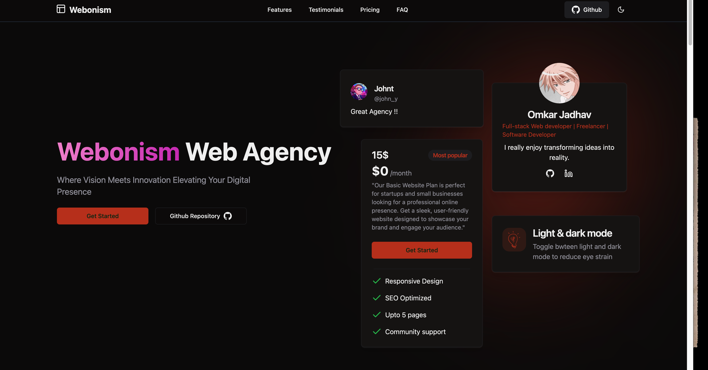
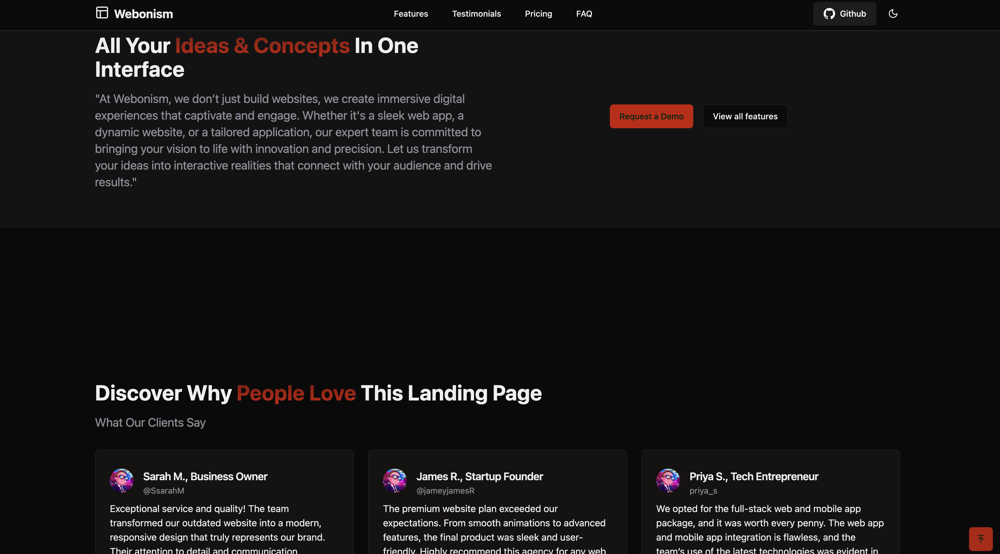
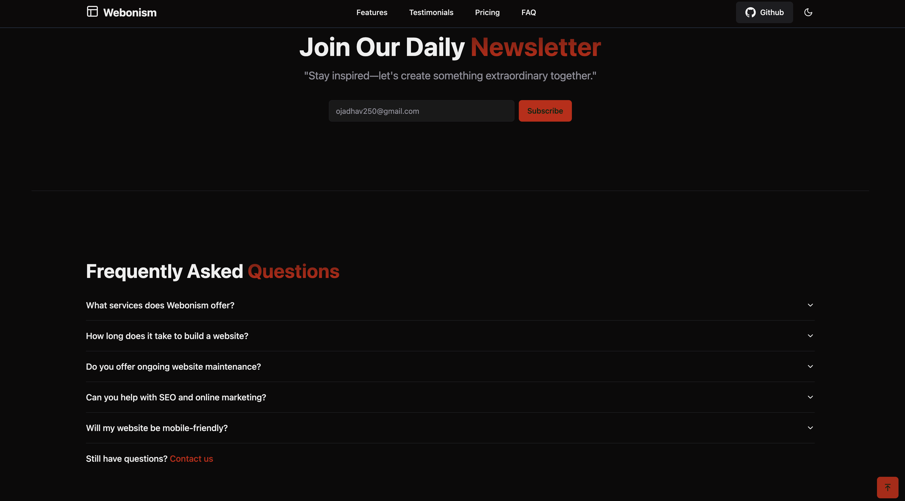

# Web Development Agency Website

This is a modern and responsive website for a web development agency built using **ReactJS** and **Vite**. It showcases the agency's services, pricing plans, testimonials, and client-centric approach with a clean and intuitive design.

---

## Features

- **Fast and Optimized**: Built with Vite for lightning-fast development and performance.
- **Modern Design**: Responsive layouts and animations for a seamless user experience.
- **Client-Focused Content**: Includes sections like Client-Centric Services, Pricing Plans, Testimonials, and more.
- **Scalable and Modular**: Designed to grow with your agency's needs, with clean and maintainable code.
- **Accessibility**: Ensures inclusivity with a focus on accessibility standards.

---

## Technologies Used

- **ReactJS**: For building interactive and dynamic user interfaces.
- **Vite**: For a faster and modern build tool.
- **CSS Modules**: For scoped and maintainable styles.
- **React Icons**: For consistent and modern iconography.
- **Axios** (Optional): For API integration and data fetching.

---

## Installation and Setup

1. **Clone the Repository**  
   ```bash
   git clone https://github.com/your-username/agency-website.git
   cd agency-website
2. npm install

3.npm run dev

4.npm run build

###Project Structure

##src/
├── assets/       # Static assets (images, fonts, etc.)
├── components/   # Reusable React components
├── utils/        # Helper functions and utilities
└── App.jsx       # Root component and other files


Screenshots

### Homepage


### Services Page


### FAQ Page


---

###License
This project is licensed under the MIT License. You are free to use and modify the code as per the license terms.

###Contributing
Contributions are welcome! Feel free to fork the repository and submit a pull request. Ensure your code adheres to the project's coding standards.


###Contact
For questions, feedback, or collaboration opportunities, reach out to us at ojadhav250@gmail.com or visit our webonism.vercel.app.
